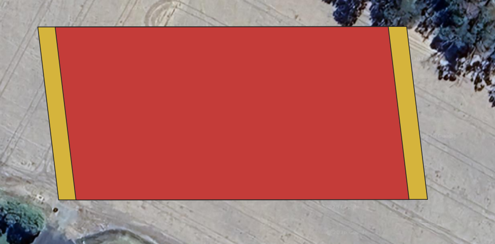

__APPN\-GOBI M350 FIELDBOOK__

*This fieldbook provides a standardised operational guide for APPN GOBI UAV deployments on the DJI M350, supporting safe flight operations, consistent sensor configuration, and high‑integrity data capture\. It is intended for trained APPN staff conducting hyperspectral, LiDAR, RGB, and GNSS‑INS data acquisitions, and promotes repeatability, transparency, and confidence in downstream data analysis across APPN operations\.*

*This protocol *__*must be followed*__* for all standard APPN GOBI UAV flights\. Adherence to these procedures is essential to ensure operational safety, data integrity, and comparability of datasets across deployments\. For any flights that *__*fall outside standard operating procedures*__*, detailed records must be kept documenting all deviations, including the specific settings changed, the rationale for those changes, and any anticipated implications for data quality or analysis\.*

__EQUIPMENT__

*Ensure batteries for all equipment are fully charged before heading to the field\. Ensure charging cables are available for necessary equipment\. *

- __Aircraft__
	- Aircraft batteries
	- Landing gear
	- Landing pad
	- Spare parts
	- Tools
	- Logbook
- __Radio Control Transmitter / Ground Control Station__
- __GRYFN Gobi__
	- Gobi system
	- Power cables, chargers
	- Ethernet cable
	- SD Card
	- ‘Capture’ polygon files
- __Ground reference kit__
	- Reflectance calibration panels \(11%, 30%, 56%, 82%\)
	- Calibration validation panels \(20%, 45%\)
	- Ground control points and RTK GNSS system
	- 2 x Folding tables to elevate panels
	- *If over 50 km from CORS base station*, a portable RTK base station \([link to GRYFN gitbook](https://gryfn.gitbook.io/gryfn-operations/operations/base-station-availability)\)
- __Accessories__
	- Safety gear \(signage and high vis vests\)
	- Aeronautical radio
	- Field laptop and spare batteries
	- External storage media
	- Water, food, esky, sunscreen, bug spray, first aid kit, etc\.
	- Spirit bubble, spirit level \(or angle measurement\) and measuring tape
	- Portable fan \(For cooling GOBI during data offload\)
	- External power brick \(For charging UAV RC\)

__FLIGHT PLANNING – DJI M350__

1. Using a GPS survey system \(Emlid, Trimble…\) or GIS software, create a polygon of the area of interest with a 5\-meter margin around area of interest\.
2. Using the GRYFN flight planning spreadsheet and DJI Pilot 2 set the parameters like speed, overlap, and altitude\. Orientation of the survey will be North\-South in a paddock, or row\-aligned for a plot trial\. 
3. Create two polygons\. A ‘survey’ polygon and a ‘capture’ polygon\. Ensure the ‘survey’ Polygon size is 2x of the Flight\-Speed larger than the ‘capture’ polygon in the direction of travel\. \(As per the figure below\)\. Save both polygons uniquely\. 

1. If using QGIS, import the ‘capture’ KML into Google earth and immediately export again\. This is due to the required formatting google earth supplies\.
2. Import the ‘capture’ KML into [HPI Polygon Tool](http://50.170.92.179/) and export\.  This polygon sets the activation of the hyperspectral sensor within Hyperspec3\. 
3. Import the ‘Survey’ polygon into DJI Pilot 2 \(M350\), or into QGround Control \(IF1200\)\. 
4. Using both the flight planning app \(DJI Pilot 2 or QGround Control\) and the GRYFN flight calculator\. Determine the speed, altitude, and frame period required to survey the area of interest\. 
5. Ensuring that the frame period is >20% oversampled and the side overlap is >30%\.

__Flight Planning – Inspired Flight IF1200A__

1. Need to add details here

__PRE\-FLIGHT__

1. Conduct airspace and weather checks\. If collecting hyperspectral data, ensure collection time must be within ±2 hours of solar noon \(refer: [https://gml\.noaa\.gov/grad/solcalc/\)](https://gml.noaa.gov/grad/solcalc/)\.
2. Set up the Emlid RTK \(install a peg OR permanent GCP below base station for recurring flights\), let it run for at least 15 minutes and start recording the RINEX file, before flying \(OPTIONAL\)\.
3. Set up reflectance targets on the tables for calibration and validation\. 2 sets of GRYFN reflectance panels should be used if available at alternate ends of the capture, with the validation panel located centrally\. Make sure you have GCPs installed \(and coordinates recorded using Emlid\) in the field for geometric calibration\.
4. Set up a safe UAV RTH location, RTH altitude and other geo\-fencing settings in the respective drone\.
5. Attach payload \(Gobi or CALViS\) to aircraft:

- Connect power cable from aircraft to payload \(Non\-Standard Payload Bus Only\)
- Connect both GNSS antenna cables to correct ports \(match A1 and A2\)
- Remove RGB & Nano HP lens cap
- Insert RGB SD Card
- For M350, connect the C\-type power cable to power the gimbal \(make sure the B side of the cable is toward the outer side of the drone and the upper side of the light sensor\)\.
- For M350, activate battery\-powered fan \(if warm ambient conditions\)\. Avoid leaving GOBI powered on in stagnant air or high heat \(>~35\-38oC\)\.

1. Power on radio controller; check battery status\.
2. Launch DJI Pilot 2 on M350, or QGroundControl on the IF1200 Controller
3. Review flight plan; checking operational height
4. Power on aircraft; confirm connection to RC/GCS and battery status; ensure Remote ID is enabled \(if flying the IF1200\)\.
5. If you are using RTK \(M350\), check that you are receiving GNSS corrections\. There should be more than >8 satellites for good correction \(Check the RTK fix in the M350 controller settings\)\. IF1200 does not use RTK, but ensure minimum 8 satellites and GPS 
6.  Upload flight plan to aircraft \(IF1200\)\.

__SENSOR CONFIGURATION__

__1__\. Place exposure reference panel under Nano HP lens; avoid casting shadows\.

• Place drone legs upon exposure\-angle\-cones\.  Ensuring a fixed angle is achieved each exposure\-setting\. __\(ANGLE PROVIDED THROUGH SIF EXCELLENCE\) __

__2__\. Connect to GOBI WiFi or connect ethernet cable to payload\. Set a static IP address for the sensor at: 10\.0\.65\.2 \(or anything other than “50”, “100”, and “128”, and must be les sthan “255”\)\.

__3__\. Navigate to GOBI WebUI at 10\.0\.65\.50\.

__4__\. Ensure valid elevation is achieved\.

__5__\. Name the mission, using the convention: YYYYMMDD\_XXXX \(where YYYY = year; MM = Month; DD = Day \(must be 2 digits\), and XXXX is a short name reference or abbreviation for the job\)\.

__6__\. Click VNIR Setup\.

__7__\. Open Flight Calculator and update altitude/speed; adjust oversampling buffer \(must be at least 20%, recommended setting is 30%\)\. __\(VALUE MAY CHANGE THROUGH HYPERSPCTRAL EXCELLENCE\)__

__8__\. Adjust exposure until ~95% __\(VALUE MAY CHANGE THROUGH HYPERSPCTRAL EXCELLENCE\) __spectral saturation at __peak of 90th percentile line__ without exceeding frame period\.

\- The maximum distance from the VNIR HS sensor to the GOBI reflectance panel is 40cm\. This is calculated based on the FOV and a 20cm panel size\. 

__9__\. Use the lowest gain mode that still provides sufficient saturation\.

__10__\. Import polygon KML or text file\.

__11__\. Put lens cap on Nano HP\.

__12\.__ Click Collect Dark Reference; remove lens cap afterward\.

__13__\. Remove exposure reference panel\.

__14__\. Press Start Mission\.

__15__\. Remove Ethernet cable and begin flight operations\.

__FLIGHT OPERATIONS__

__1__\. Ensure aircraft \(M350\) is in Position flight mode\.

__2__\. Sync flight plan to radio controller if applicable; double check flight plan\.

__3__\. Clear people/objects away from UAV\.

__4__\. Notify crew/observers that takeoff is beginning\.

__5__\. Begin manual takeoff, check stick controls work and then fly to ~12m AGL; __do not exceed__ trigger altitude \(20 m default\) before mission start\.

__6__\. Perform dynamic alignment \(one to two figure\-8 patterns\)\.

__7__\. Enable autonomous mission\.

__8__\. Monitor UAV battery voltage/percentage in flight\.

__9\.__ After mission, switch back to Position mode to regain manual control\.

__10__\. Lower to capture altitude and perform post\-mission dynamic alignment \(figure of 8\)\.

__11__\. Land and disarm UAV\.

__12__\. Leave UAV, transmitter, and sensor powered on; begin post\-flight checks\. Ensure data transfer is finished before turning off the sensor\.

__13__\. __DO NOT hot swap the batteries__\. Treat each flight as a new flight\.

__POST\-FLIGHT SENSOR CONFIGURATION__

__1__\. Reconnect to GOBI WiFi or ethernet cable\.

__2__\. Open browser to 10\.0\.65\.50 or refresh UI\.

__3__\. Press Stop Mission\.

__4\.__ Replace Nano HP and RGB lens caps\.

__5\.__ Open WinSCP or equivalent and confirm data\.

__POST\-FLIGHT__

__1__\. Disconnect ethernet cable from payload\.

__2__\. Disconnect aircraft batteries\.

__3__\. Disconnect payload power cable\.

__4__\. Disconnect payload GNSS cables\.

__5__\. Undo mounting clamp, remove payload, place in case\.

__DATA CONFIRMATION__

__SENSOR TYPE__

__GNSS\-INS__

__LiDAR __

__VNIR__

__RGB__

__FILE COUNT__

1 file

1 per minute 

Mission time \(s\) ÷ Frame Period value ≈ number of data cubes 

Image every 2s\* \(by default\) 

__FILE SIZE__

~1\.5 MB per minute

~175 MB per file 

VNIR data should capture several GB of data for even short flights\. 

~30 \- 70MB per image 

__NOTES__

A new file will be created if time rolls over the hour \(UTC time, not capture time\)\. 

First & last file may be smaller\.

Files may be smaller if over low reflectivity object\.

Check that frameindex, imu\_gps, settings files all exist\. 

Check event file vs number of images 

__OFFLOAD DATA__

- 
	- 
		- 
			1. Open WinSCP or similar FTP software\.
			2. Connect to GRYFN Gobi via gryfn@10\.0\.65\.50 \(password: gryfn\)\.
			3. Raw GNSS & LiDAR PCAP location: /data/\{mission name\}\.
			4. VNIR data location: /data/capturedData/captured/\{dateTime\}\.
			5. GOBI logs location: /data/gryfn\.log\.\{date\}\.

1. RGB images stored on camera SD card\.
2. Download GNSS, LiDAR, logs, and RGB after each mission; download hyperspectral data later due to size\.
3. Clear data directories after download to avoid filling the 500GB SSD\.

__APPENDIX__

__FTP GOBI__

__FTP SBG__

__HEADWALL POLYGON__

__Protocol__: FTP

__IP__: 10\.0\.65\.50

__Port__: 22

__User__: gryfn

__Password__: gryfn

__Protocol__: FTP

__IP__: 10\.0\.65\.100

__Port__: 21

__User__: operator

__No__ password

apps\.headwallphotonics\.com

1\. Import KML

    • Must be in Google Earth format\. 

2\. Export KML

3\. Save KML

4\. In File Explorer, rename KML as survey name

__SETTING STATIC IP ADDRESSES__

__IP ADDRESS__

If connecting over ethernet connection, a static IP address will need to be set\.

1. Open Network and Internet Settings\.
2. Change Adapter Options\.
3. Open Properties for Ethernet port/adapter\.
4. Open Properties for IPv4\.
5. Set IP address to 10\.0\.65\.2\.
6. Set subnet mask to 255\.255\.255\.0\.
7. Press OK\.

__GRYFN WebUI__: 10\.0\.65\.50

__HSInsight__: 10\.0\.65\.50:8080

__Ouster__: 10\.0\.65\.128

__SBG:__ 10\.0\.65\.100

