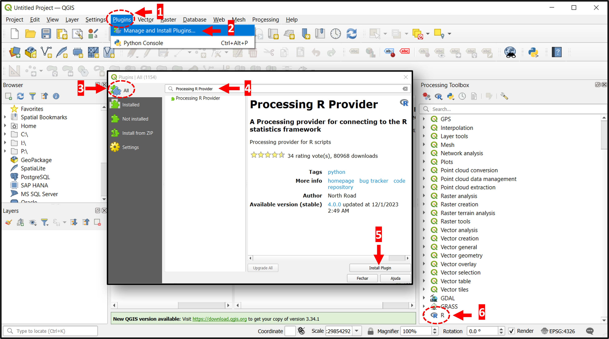
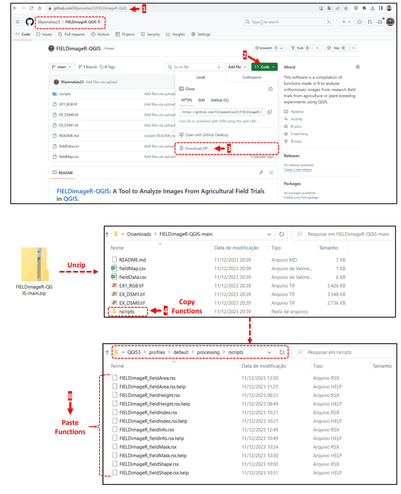
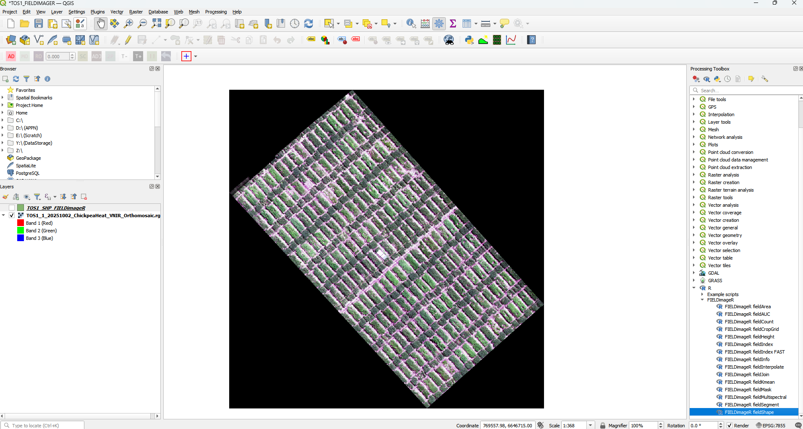
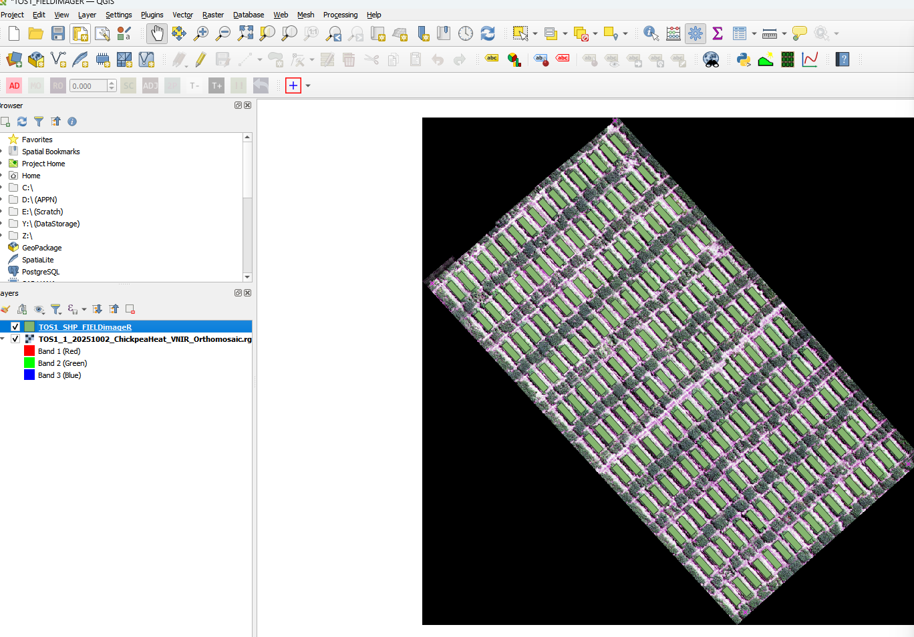

# APPN – Plot Delimitation

This protocol defines the APPN standard for plot delimitation shapefiles —
their structure, attributes, and storage location within the APPN folder
hierarchy — and documents the supported methods for producing them from
APPN aerial imagery (typically RGB orthomosaics captured by GRYFN UAV
systems). Consistent plot delimitation underpins repeatable phenotypic
analysis across APPN trials.

> [!IMPORTANT]
> The APPN plot shapefile specification below must be followed for all
> trials, regardless of which method is used to generate the shapefile.
> For any deviations from this specification or these methods (e.g.
> alternative tools, non-standard plot layouts), keep detailed records of
> the changes made, the rationale, and any implications for downstream
> analysis.

---

## APPN Plot Delimitation

A standard APPN plot delimitation approach ensures that comparable trials can
be analysed consistently across nodes. The goal is to maximise the usable
plot area sampled by the aerial data while minimising two competing sources
of error:

- **Edge effects** — agronomic and radiometric contamination from
  neighbouring plots, alleys, and bare soil at plot boundaries.
- **Positional uncertainty** — small misalignments between the plot
  shapefile and the orthomosaic caused by GNSS/RTK error, orthorectification
  residuals, and sowing/layout drift (rows bowing or skewing relative to
  the design grid as the seeder tracks across the trial).

In practice, this is achieved by applying a consistent inward **buffer** to
each plot polygon so the analysed region sits comfortably inside the true
plot extent, regardless of which method is used to generate the shapefile.

### Recommended Buffer

> [!IMPORTANT]
> The buffer values, worked examples, and guidance in this section are
> **placeholders** derived from a quick literature scan. They are included
> to demonstrate the intended formatting and layout of this section and
> **must not be treated as the APPN standard** until reviewed and approved
> by the APPN Field EWG. The agreed-upon values will replace the numbers
> shown here.

To keep results comparable across nodes, APPN trials should apply a
consistent inward buffer to every plot polygon. The default rule is:

> **APPN default buffer:** 0.3 m from each plot end (along the drill
> direction) and 0.2 m from each plot side (across the drill direction),
> **or** 15% of the corresponding plot dimension — whichever is larger.

The buffer used must be recorded in the tool-specific configuration saved
alongside the shapefile (e.g. the FIELDimageR JSON) so the layout can be
reproduced.

#### Worked examples

| Plot size (L × W)              | Buffer (end / side) | Analysis area (L × W)   | % of plot |
| ------------------------------ | ------------------- | ----------------------- | --------- |
| 6 m × 2 m (cereal yield plot)  | 0.5 m / 0.25 m      | 5.0 m × 1.5 m           | ~63%      |
| 4 m × 1.5 m (small breeding)   | 0.3 m / 0.2 m       | 3.4 m × 1.1 m           | ~62%      |
| 2 m × 1 m (micro-plot)         | 0.2 m / 0.15 m      | 1.6 m × 0.7 m           | ~56%      |
| 10 m × 3 m (agronomy strip)    | 1.0 m / 0.5 m       | 8.0 m × 2.0 m           | ~53%      |

#### When to increase the buffer

- Coarser GSD (e.g. hyperspectral at ~5 cm vs RGB at ~1 cm).
- Tall or lodging-prone canopies where canopy lean shifts the visible plot
  off its sown footprint.
- Narrow alleys (<0.5 m) where neighbouring canopies merge.
- Trials without RTK GNSS or without ground control points (GCPs) in the
  orthomosaic.

#### When a smaller buffer may be acceptable

- RTK-georeferenced GCPs present in the orthomosaic.
- Wide alleys with bare inter-row visible between plots.
- Short, erect canopies (e.g. wheat pre-anthesis).

> [!NOTE]
> Any deviation from the default buffer must be recorded with the trial's
> plot layout files and justified in the trial notes.

---

## APPN Plot Shapefile Standard

All APPN plot shapefiles must conform to the following standard so that
downstream pipelines can ingest them without trial-specific configuration.

### File format

- Format: ESRI Shapefile (`.shp` plus its sidecar files `.shx`, `.dbf`,
  `.prj`, `.cpg`).
- CRS: the CRS of the source orthomosaic (typically a projected UTM zone
  in metres). The `.prj` file must be present.
- Geometry: one polygon per plot. Polygons should be rectangular and
  aligned to the trial layout, sized to the plot dimensions plus any
  buffer applied to mitigate edge effects.

### Required attributes

Each plot polygon must carry, at minimum:

- `fid` — unique plot identifier assigned by the delimitation tool.
- Trial metadata columns joined from a trial spreadsheet (see
  [Joining Trial Information](#joining-trial-information)), such as
  range/row indices, plot number, entry/genotype, replicate, and
  treatment.

### Storage location

Save the shapefile (and all sidecar files) in the site-level
`Documentation/Plot_Layout/` directory under the APPN folder structure (see
the [APPN folder structure wiki](https://github.com/ArdenB/APPN_GenricFileStorage/wiki/Folder-Structure)
for the full naming convention).

Formal path:

```
{Node}/{YYYY_ProjectDesc[_I|E][_Researcher][_org]}/{YYYYSiteName[_F|C]}/Documentation/Plot_Layout/
```

Example:

```
USYD_Narrabri/2025_SIFOzBarley/2025IAWatson_F/Documentation/Plot_Layout/
```

Also save the tool-specific configuration used to generate the shapefile
(e.g. the FIELDimageR JSON settings) alongside it so the layout can be
reproduced.

---

## Joining Trial Information

Most delimitation tools produce a shapefile whose plots are identified
only by `fid`. Trial metadata is attached as a separate step:

1. Prepare a spreadsheet (CSV or XLSX) of trial information with one row
   per plot and a column whose values match the shapefile's `fid`.
2. In QGIS, load both layers and use **Properties → Joins** on the
   shapefile to join the spreadsheet on the `fid` field.
3. Export the joined layer back to a shapefile in the same `Plot_Layout`
   directory so the trial metadata is persisted in the `.dbf`.

---

## Methods

The following methods are supported for generating an APPN-compliant plot
shapefile. Choose the method that best matches your imagery and tooling;
the resulting shapefile must satisfy the
[APPN Plot Shapefile Standard](#appn-plot-shapefile-standard) above.

- [Method 1: FIELDimageR (QGIS)](#method-1-fieldimager-qgis)
- *(Additional methods to be added.)*

---

## Method 1: FIELDimageR (QGIS)

FIELDimageR is an R-based plugin run from within QGIS that builds plot
polygons from a georeferenced orthomosaic.

### Software Installation

Install the following software to start the pipeline:

1. [R](https://www.r-project.org/)
2. [QGIS](https://qgis.org/en/site/)

> [!NOTE]
> The first time you run FIELDimageR-QGIS it may take some time to install
> all required R packages.

#### Enable the Processing Toolbox in QGIS

Make sure the **Processing Toolbox** panel is visible in QGIS:

1. Open the **View** menu.
2. Select **Panels**.
3. Enable **Processing Toolbox**.
4. Confirm the Processing Toolbox is now showing on the right-hand side.


#### Install the Processing R Provider plugin

Install the **Processing R Provider** plugin in QGIS:

1. Open the **Plugins** menu.
2. Select **Manage and Install Plugins**.
3. Switch to the **All** tab.
4. Search for *Processing R Provider*.
5. Click **Install Plugin**.
6. Verify that **R** now appears in the Processing Toolbox.



#### Install FIELDimageR

1. Go to the FIELDimageR-QGIS GitHub repository:
   [https://github.com/filipematias23/FIELDimageR-QGIS](https://github.com/filipematias23/FIELDimageR-QGIS).
2. Click **Code**.
3. Select **Download ZIP**.
4. Unzip the archive and copy the functions from the `rscripts` folder
   into your **QGIS R scripts** folder.
5. To locate the QGIS R scripts folder, go to
   **QGIS → Processing Toolbox → Options** (the wrench icon).
6. Under **Providers**, click **R**.
7. Copy the path shown for **R scripts folder** and open it in your file
   explorer.
8. Paste the FIELDimageR functions downloaded from GitHub into the
   `rscripts` folder.




### Generating the Plot Shapefile

With FIELDimageR set up, you can now generate plot shapefiles from your
aerial imagery.

1. Load an image into QGIS. An RGB orthomosaic from a GRYFN drone is the
   easiest starting point.

   

2. Open the **fieldShape** module from the Processing Toolbox.

   

3. Fill in the module parameters:
   - Number of **rows** and **columns**.
   - The **corners** of the trial area (most critical for an accurate
     fit).
   - **Plot size**.
   - **Buffer** — essential for establishing a common analysis area by
     mitigating edge effects.

4. Click **Run**.

   

5. The plot shapefile will be generated.

> [!NOTE]
> Achieving a perfect fit usually takes some iteration on the corner
> coordinates. (TODO: improve this workflow.)

#### Save your settings

Save your fieldShape settings before closing the tool — inputs will be
wiped if FIELDimageR is closed.


Use **Copy as JSON** and save the contents as a text file alongside the
shapefile in the trial's `Plot_Layout` directory.

### Output

The shapefile produced by FIELDimageR contains plots identified only by
`fid`.


Attach trial metadata as described in
[Joining Trial Information](#joining-trial-information), then save the
final shapefile to the trial's `Plot_Layout` directory per the
[APPN Plot Shapefile Standard](#appn-plot-shapefile-standard).

---

## Method 2: *(DPRID METHOD TBD)*

> [!NOTE]
> Additional plot delimitation methods will be documented here as they
> are adopted by APPN.
