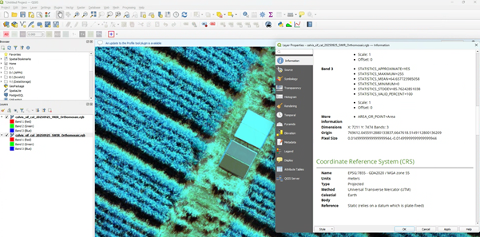
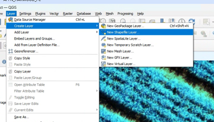
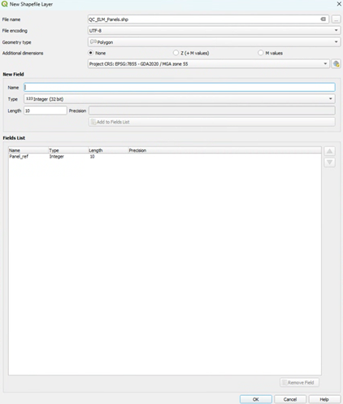
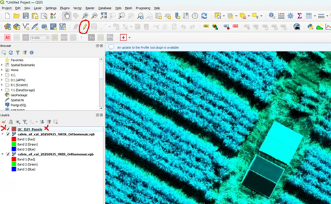
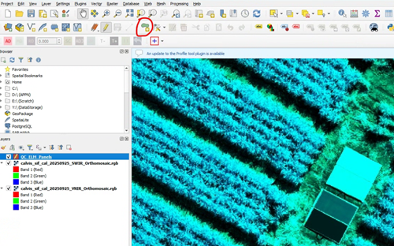
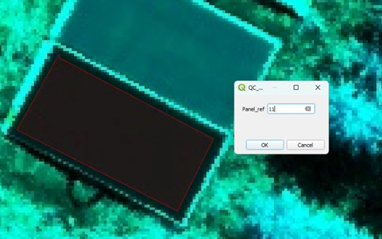
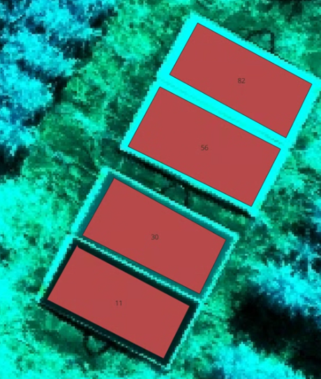
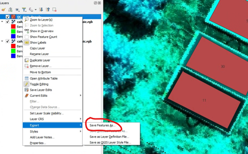
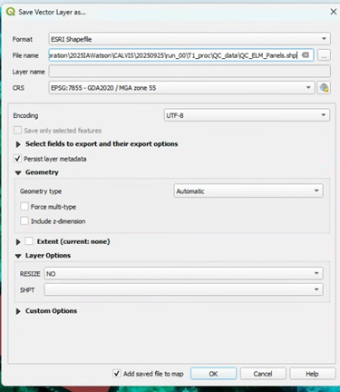

# APPN – Aerial Data QC Protocols

> This document describes procedures for measuring the uncertainty of drone
> flights. It currently focuses on assessing the accuracy of existing flights
> in the lead-up to Cali Week 2026. It will also form the basis of a standard
> QC procedure for future flights. Initially this document focuses on the
> hyperspectral drones, but the procedure will expand in the future.

> [!NOTE]
> Future flights are likely to consist of multiple sets of panels for both ELM
> and validation, ground control points (to test GNSS) and other reflectance
> targets for LiDAR calibration.

---

## Spectral QC

Spectral QC is done by drawing polygons in GIS software over surfaces with
known spectral values, then extracting and comparing them. This is done after
all processing in software like GPT is complete.

CALViS and GOBI flights conducted prior to the *Operational Excellence in APPN
Hyperspectral Imaging* SIF likely consist of one GRYFN reflectance panel
(used to generate the ELM in the GRYFN Processing Tool) along with additional
panels for validation.

### Naming Conventions

| Name | Overview |
| ---- | -------- |
| `QC_ELM_Panels.shp` | Shapefile of the reflectance panels used in the ELM during GRYFN Processing. |
| `QC_VAL_Grfyn_Panels.shp` | When a second set of GRYFN panels is placed in the field. Replace *ELM* with *VAL* for validation. |
| `QC_VAL_{PanelName}_Panels.shp` | Any future validation panels or tests of other panels. Replace `{PanelName}` with the name or unique identifier of the panel. |
| `QC_GCP_points.shp` | If alternative GCP points (like Aeropoints) are placed in the field. This should be a points-only file and the points should match the centre of the panels. |
| `QC_LIDAR_{TargetName}_Surface.shp` | Name for any future LiDAR calibration surfaces. |

> [!TIP]
> Any additional information (e.g. date) can be added to the end of the file
> name with an underscore — e.g. `QC_ELM_Panels_20260302.shp`. This table
> will be updated if we source panels other than GRYFN.

### File Storage

Any files created in the quality control steps are to be stored in a newly
created `QC_data` folder inside `T1_proc`. An example full path:

```
./USYD_Narrabri/2025_SIFCal/2025IAWatson/CALVIS/20250825/run_00/T1_proc/QC_data
```

These shapefiles are meant to be created after the GPRO has been completed.
The APPN storage repo has been updated to include this folder:
<https://github.com/ArdenB/APPN_GenricFileStorage>

---

## Creating Shapefiles — GOBI & CALViS (QGIS)

> The description below shows the procedure for creating shapefiles for the
> CALViS using GRYFN reflectance panels for ELM. The process for the GOBI is
> the same, but there is only the VNIR orthomosaic.

For the CALViS, in the products folder of the completed GPRO you will find the
`.tif` files:

- `X__VNIR_Orthomosaic.rgb`
- `X_calvis_sif_cal_20250925_SWIR_Orthomosaic.rgb`

These are the RGB bands from the VNIR and SWIR files respectively. They can be
easier to use than the full `.bin` files, though the procedure is the same.

### 1. Load the Data

1. Load both files into QGIS and run the following checks:
   - Do the panels in the SWIR and VNIR overlap?
   - Make note of the CRS.



*Figure: The VNIR is set to 50% opacity to confirm the panels overlap with the
SWIR. The information panel is open on the SWIR to confirm the CRS (EPSG:7855
– GDA2020 / MGA zone 55). This CRS is for Narrabri NSW where this CALViS
flight was collected.*

### 2. Create the Shapefile

1. Navigate to **Layer → Create Layer → New Shapefile Layer**.

   

2. Set the **File Name** to `QC_ELM_Panels.shp` (see the
   [naming conventions](#naming-conventions) table for the correct name given
   your use case).
3. Set the **Geometry type** to *Polygon*.
4. Set the **CRS** to match your dataset.
5. Add a single field — `Panel_ref`:
   - Select the pre-filled `id` field in the Fields list and click
     **Remove Field** (bottom right) to remove it.
   - Set `Panel_ref` as an **Integer** between 0–100. It is the percentage
     reflectance (e.g. 11, 30, 56, 82 for GRYFN panels).

   > [!IMPORTANT]
   > You need to click **Add to Fields List** once you populate "New Field".

   

### 3. Draw Boxes over the Panels

The boxes should be polygons drawn inside the panel. The points should be
drawn to cover as much of the panel as possible without including edge effects
(2–3 pixels from the edge of the panel). If there are gaps or missing values
within the panel, they should be included.

1. Select `QC_ELM_Panels` in the **Layers** menu.
2. Click the pencil icon (**Toggle Editing**).

   

3. Click **Add Polygon Feature**
   .
4. Click four points around a specific reflectance panel, then right-click to
   close the polygon. Repeat for all panels (e.g. 11, 30, 56, 82).

   

### 4. Sanity Check Labels

1. Double-click `QC_ELM_Panels` in the **Layers** menu.
2. In **Layer Properties**, click **Labels** and select **Single Labels**.

   

### 5. Save the Shapefile

1. Right-click `QC_ELM_Panels` in the **Layers** menu → **Export → Save
   Features As**.

   

2. The presets are fine — just make sure the **File Name** is correct and in
   the right folder (click the three dots to navigate). Double-check the
   **CRS**.

   

---

## Extracting Pixels into a Table

Arden Burrell has made a Python script that can go through the APPN standard
folder structure, extract the values into a table, and save that as a `.csv`
or `.parquet` file automatically. The code is available from:

<https://github.com/ArdenB/APPN_GenricFileStorage>

- **Script:** `Code/DS02_DatasetQA/QA00_ELMvaliditation.py`
- **README:** `Code/DS02_DatasetQA/README.md`

If nodes choose to extract the points using other means, the tables should
have the following columns:

```
band, wavelength, value, Panel_ref, node, project, site, sensor, date, run, panel_name, type, gpro_nu
```

---

## Positional QC

> [!WARNING]
> This section is still a work in progress.

If alternative GCP points (like Aeropoints) are placed in the field, another
shapefile should be created. This should be a points-only file and the points
should match the centre of the panels. It should be saved as:

`QC_GCP_points.shp`

The point name should be saved in a column called `point_num` and the number
should match the point number in the matching CSV file.

---

## LiDAR QC

> [!WARNING]
> This section is still a work in progress.

